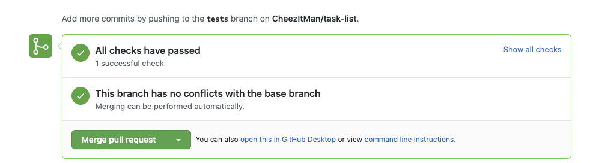

# Rideshare Rails Project

<!-- >>>>>>>>>>>>>>>>>>>>>> BEGIN CHALLENGE >>>>>>>>>>>>>>>>>>>>>> -->
<!-- Replace everything in square brackets [] and remove brackets  -->

<!-- >>>>>>>>>>>>>>>>>>>>>> BEGIN CHALLENGE >>>>>>>>>>>>>>>>>>>>>> -->
<!-- Replace everything in square brackets [] and remove brackets  -->

### !challenge

* type: short-answer
* id: 77deaa73-82cf-435b-a9cc-0a44316f4f34
* title: Rid-Share-Rails Pull Request
* points: 3
* topics: rails

##### !question

**One** team member forks and clones the [Ada-C14 Ride-Share-Rails Repo](https://github.com/Ada-c14/ride-share-rails).

Then add your partner as a collaborator.  Then your partner can clone the repository as well.

Then cd into the folder with `cd ride-share-rails`

Then create a new rails project with `rails new .`

Then complete the project and create a pull request. 

When you create the pull request your tests will automatically run and you can see the results at the bottom of the PR.

Notice that it says, **"All checks have passed".** You can  click on **Show all checks** and see the results of the tests.

Please submit a link to your pull request here.

##### !end-question

##### !placeholder

PR Link

##### !end-placeholder

##### !answer

^https:\/\/github\.com\/[^\/]+\/[^\/]+\/pull\/\d?\d[\/]?

##### !end-answer

<!-- other optional sections -->
<!-- !hint - !end-hint (markdown, users can see after a failed attempt) -->
<!-- !rubric - !end-rubric (markdown, instructors can see while scoring a checkpoint) -->
<!-- !explanation - !end-explanation (markdown, students can see after answering correctly) -->

### !end-challenge

<!-- ======================= END CHALLENGE ======================= -->