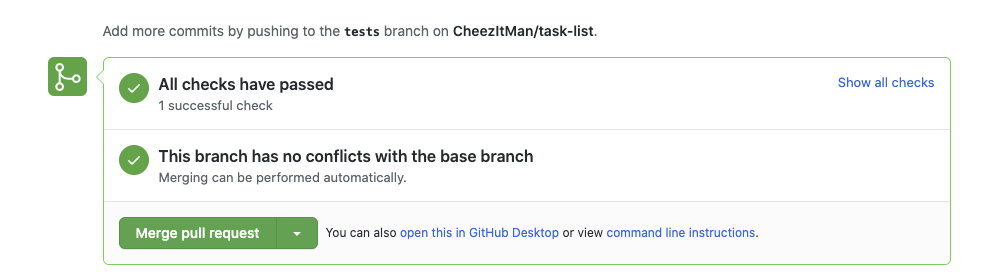

# Media Ranker

<!-- >>>>>>>>>>>>>>>>>>>>>> BEGIN CHALLENGE >>>>>>>>>>>>>>>>>>>>>> -->
<!-- Replace everything in square brackets [] and remove brackets  -->

### !challenge

* type: short-answer
* id: af8ba3ac-f88b-4be5-8b23-afe282267f40
* title: Media-ranker Pull Request
* points: 3
* topics: rails

##### !question

Please fork and clone the [Ada-C14 Media Ranker Repo](https://github.com/Ada-C14/media-ranker).

Then cd into the folder with `cd media-ranker`

Then create a new rails project with `rails new .`

Then complete the project and create a pull request. 

When you create the pull request your tests will automatically run and you can see the results at the bottom of the PR.

Notice that it says, **"All checks have passed".** You can  click on **Show all checks** and see the results of the tests.

Please submit a link to your pull request here.

**Due:  Monday November 16th 9am**

##### !end-question

##### !placeholder

PR Link

##### !end-placeholder

##### !answer

^https:\/\/github\.com\/[^\/]+\/[^\/]+\/pull\/\d?\d[\/]?

##### !end-answer

<!-- other optional sections -->
<!-- !hint - !end-hint (markdown, users can see after a failed attempt) -->
<!-- !rubric - !end-rubric (markdown, instructors can see while scoring a checkpoint) -->
<!-- !explanation - !end-explanation (markdown, students can see after answering correctly) -->

### !end-challenge

<!-- ======================= END CHALLENGE ======================= -->
