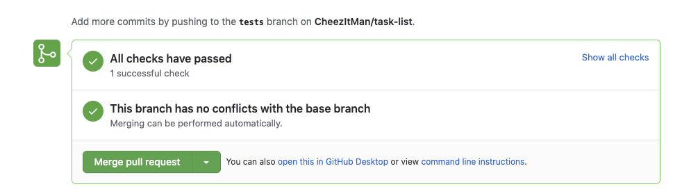

# TaskList

<iframe src="https://adaacademy.hosted.panopto.com/Panopto/Pages/Embed.aspx?id=5436d2cc-09e9-4aed-8da2-ac5b0022db7d&autoplay=false&offerviewer=true&showtitle=true&showbrand=false&start=0&interactivity=all" height="405" width="720" style="border: 1px solid #464646;" allowfullscreen allow="autoplay"></iframe>

<!-- >>>>>>>>>>>>>>>>>>>>>> BEGIN CHALLENGE >>>>>>>>>>>>>>>>>>>>>> -->
<!-- Replace everything in square brackets [] and remove brackets  -->

### !challenge

* type: short-answer
* id: ead1577c-abd6-414b-a7a6-582176294a7d
* title: TaskList Pull Request
* points: 3
* topics: rails

##### !question

Please fork and clone the [Ada-C14 Tasklist Repo](https://github.com/Ada-C14/task-list).

Then cd into the folder with `cd tasklist`

Then create a new rails project with `rails new .`

Then complete the project and create a pull request. 

When you create the pull request your tests will automatically run and you can see the results at the bottom of the PR.

Please submit a link to your pull request here.

##### !end-question

##### !placeholder

PR Link

##### !end-placeholder

##### !answer

/^https:\/\/github\.com\/[^\/]+\/pull\/[^\/]+\/\d?\d/

##### !end-answer

<!-- other optional sections -->
<!-- !hint - !end-hint (markdown, users can see after a failed attempt) -->
<!-- !rubric - !end-rubric (markdown, instructors can see while scoring a checkpoint) -->
<!-- !explanation - !end-explanation (markdown, students can see after answering correctly) -->

### !end-challenge

<!-- ======================= END CHALLENGE ======================= -->